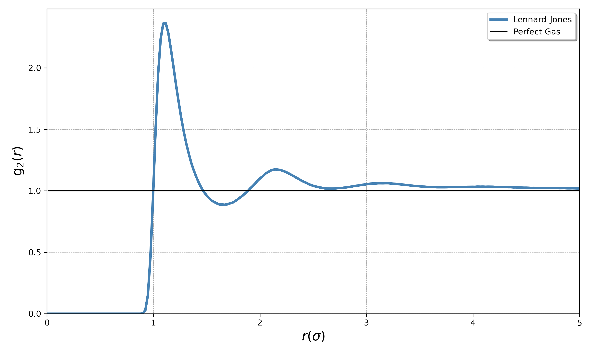

# TriCorreX
Any practioner and/or enthasuasist of molecular dynamics has likely come across the radial distrubtion function (RDF). The RDF is a simple yet robust way to characterize a system: compares the configuration of a particles local enviroment to their configuration in a perfect gas. In a perfect gas the particles behave at random and show no perference in regards to distance seperation. But for interacting particles, if the potential in use provides attractive distances, those distances will find on average higher particle counts, like below for the classic Lennard-Jones (LJ) fluid. 

This reveals the perferred 2-body seperation distrubtion at $\rho^{*}=0.45$ and $T^{ *}=1.0$. With a maximum at $\approx 1.12 \ \sigma$. In practice, the RDF is approximated by dividing the radial distance of interest into seperate bins, and couting how many pair seperation distances fall within each bin (i.e. how many pairs of particles were seperated by a distance $d \in \lbrace r-\Delta r / 2, \ r+\Delta r / 2 \rbrace$). The choice of $\Delta r$ leads to finer or coarser binning, which can *potentially* lead to problems down the line. However, thoughtful smoothing can mitigate if not eliminate these issues. In general, measuring the RDF is safe in that their are few if any suprises in it's approximation.  

The situation complicates itself when it comes to 3-body interactions. While 2-body interactions can be characterized by *one* pair seperation distance, 3-body interactions require accounting for 3 independent pair seperation distances. For a pair ijk with seperation distances $r_{\text{ij}}$, $r_{\text{ik}}$, $r_{\text{jk}}$ we now need a bin accounting for a triplet centered at some 3 distances such that the bin width captures all 3. If we needed N bins for the RDF approximation, we now need $N^3$ bins to adequetly measure the 3-body correlations. This quickly reminds us of the curse of dimensionality, where far more data is needed as the dimensionality of the underlying distribution is increased. 

